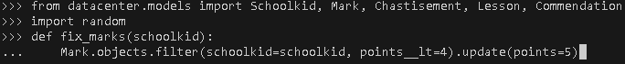

# Взламываем электронный дневник

Тут собраны необходимые функции для помощи Вани в исправлении оценок, замечаний и похвалы.

## Описание функций

- `fix_marks` - Исправляет все плохие отметки Вани на хорошие.
- `remove_chastisements` - Эта функция удаляет все замечания.
- `create_commendation` - С помощью неё вы можете написать сами себе новую похвалу

## Запуск

- Скачайте код
- Установите зависимости командой `pip install -r requirements.txt`
- Запустить shell `python manage.py shell`
- Нужно вставить строки:

`from datacenter.models import Schoolkid, Mark, Chastisement, Lesson, Commendation`

и

`import random`
- Выбрать нужную функцию и вставить в терминале
- Пример вставки функции:

- Запустить и проверить

## Цели проекта

Код написан в учебных целях — это урок в курсе по Python и веб-разработке на сайте [Devman](https://dvmn.org).
